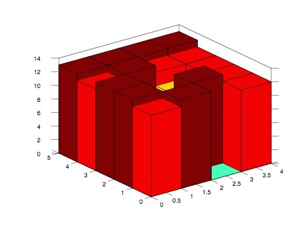

# 364. Trapping Rain Water II

Difficulty: Hard

http://lintcode.com/en/problem/trapping-rain-water-ii/

Given n x m non-negative integers representing an elevation map 2d where the area of each cell is 1 x 1, compute how much water it is able to trap after raining.



**Example**  
Given 5*4 matrix
```
[12,13,0,12]
[13,4,13,12]
[13,8,10,12]
[12,13,12,12]
[13,13,13,13]
```
return 14.
