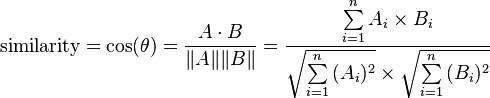

# 445. Cosine Similarity

Difficulty: Easy

http://lintcode.com/en/problem/cosine-similarity/

Cosine similarity is a measure of similarity between two vectors of an inner product space that measures the cosine of the angle between them. The cosine of 0° is 1, and it is less than 1 for any other angle.

See wiki: Cosine Similarity

Here is the formula:

Given two vectors A and B with the same size, calculate the cosine similarity.

Return 2.0000 if cosine similarity is invalid (for example A = [0] and B = [0]).

**Example**  
Given A = [1, 2, 3], B = [2, 3 ,4].

Return 0.9926.

Given A = [0], B = [0].

Return 2.0000
