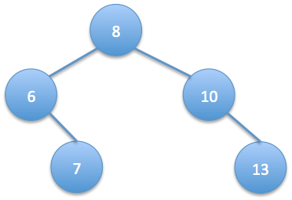

# 701. Trim Binary Search Tree

Difficulty: Medium

http://www.lintcode.com/en/problem/trim-binary-search-tree/

Given the root of a binary search tree and 2 numbers min and max, trim the tree such that all the numbers in the new tree are between min and max (inclusive). The resulting tree should still be a valid binary search tree. So, if we get this tree as input:

and we’re given min value as 5 and max value as 13, then the resulting binary search tree should be:

**Example**  
Given binary search tree:
{8,3,10,1,6,#,14,#,#,4,7,13} and minVal = 5, maxVal = 13.

One possible answer: {8, 6, 10, #, 7, #, 13}
