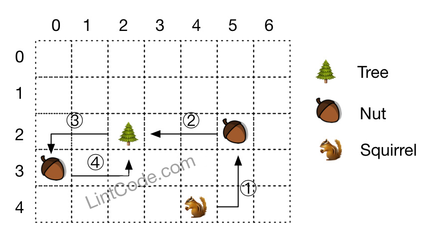

# 873. Squirrel Simulation

Difficulty: Medium

http://www.lintcode.com/en/problem/squirrel-simulation/

There's a tree, a squirrel, and several nuts. Positions are represented by the cells in a 2D grid. Your goal is to find the minimal distance for the squirrel to collect all the nuts and put them under the tree one by one. The squirrel can only take at most one nut at one time and can move in four directions - up, down, left and right, to the adjacent cell. The distance is represented by the number of moves.!

**Note**  
1. All given positions won't overlap.
2. The squirrel can take at most one nut at one time.
3. The given positions of nuts have no order.
4. Height and width are positive integers. 3 <= height * width <= 10,000.
5. The given positions contain at least one nut, only one tree and one squirrel.

**Example**  
```
Given 
height = 5,
width = 7,
treePosition = [2,2],
squirrel = [4,4],
nuts = [[3,0], [2,5]],

return 12.
```
**Explanation**  

