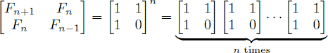

# 949. Fibonacci II

Difficulty: Easy

http://www.lintcode.com/en/problem/fibonacci-ii/

In the Fibonacci integer sequence, F0 = 0, F1 = 1, and Fn = Fn − 1 + Fn − 2 for n ≥ 2. For example, the first ten terms of the Fibonacci sequence are:0,1,1,2,3,5,8,13,21,34,…
An alternative formula for the Fibonacci sequence is:

Given an integer n, your goal is to compute the last 4 digits of Fn

**Notice**  
1. 0 ≤ n ≤ 1,000,000,000
2. If the last four digits of Fn are all zeros, print ‘0’; otherwise, omit any leading zeros(print Fn mod 10000)

**Notice**  
1. The number of tasks is in the range [1, 10000].
2. The integer n is in the range [0, 100].

**Example**  
Given: n = 9  
Return: 34
