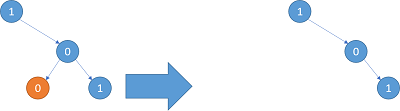

# 1003. Binary Tree Pruning

Difficulty: Medium

https://www.lintcode.com/problem/binary-tree-pruning/description

**Description**  
We are given the head node root of a binary tree, where additionally every node's value is either a 0 or a 1.

Return the same tree where every subtree (of the given tree) not containing a 1 has been removed.

(Recall that the subtree of a node X is X, plus every node that is a descendant of X.)

1. The binary tree will have at most 100 nodes.
2. The value of each node will only be 0 or 1.

**Example**  
```
Example 1:
Input: [1,#,0,0,1]
Output: [1,#,0,#,1]
 
Explanation: 
Only the red nodes satisfy the property "every subtree not containing a 1".
The diagram on the right represents the answer.
```


```
Example 2:
Input: [1,0,1,0,0,0,1]
Output: [1,#,1,#,1]
```


```
Example 3:
Input: [1,1,0,1,1,0,1,0]
Output: [1,1,0,1,1,#,1]
```

