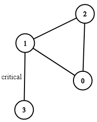

# 1271. Critical Connections in a Network

Difficulty: Hard

https://www.lintcode.com/problem/critical-connections-in-a-network/description

**Description**  
There are n servers numbered from 0 to n-1 connected by undirected server-to-server connections forming a network where connections[i] = [a, b] represents a connection between servers a and b. Any server can reach any other server directly or indirectly through the network.

A critical connection is a connection that, if removed, will make some server unable to reach some other server.

Return all critical connections in the network in any order, but you should guarantee that for each connections, when you return, index1 is less than index 2. For instance, if the answer is [[1,2],[3,4]] you can return [[3,4],[1,2]], but [[2,1],[3,4]] is invaild.

* 1 <= n <= 10^5
* n-1 <= connections.length <= 10^5
* connections[i][0] != connections[i][1]
* There are no repeated connections.

**Example**  
```
Input:
4
[[0,1],[1,2],[2,0],[1,3]]
Output: [[1,3]]
```
Explanation:


